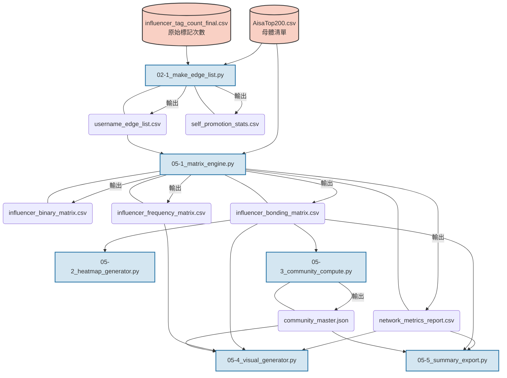

## 資料流

## 整體運算

:::mermaid
graph LR
A[原始互動紀錄 Source, Target, Count] --> B(邊清單 Edge List 過濾母體與自我標記)
B --> C1{Frequency Matrix 有向事實次數}
B --> C2{Bonding Matrix 無向加權強度}

    C1 --> D1((有向圖 DiGraph 計算出/入分支度))
    C2 --> D2((無向圖 Graph 計算中介中心性))

    D2 --> E[社群偵測演算法 Walktrap/Louvain/Greedy]
    E --> F[合併長尾群組 Top 12 + 1 其他小群]

    F --> G1[視覺化 Layout Spring Layout 拉近強連結]
    D1 --> G2[視覺化繪圖 畫出箭頭與互動粗細]

    G1 --> H[最終圖表與報告匯出]
    G2 --> H

:::

## 05-1_matrix_engine.py 程式碼邏輯

:::mermaid
graph TD
Start([Start 05-1]) --> Load[載入 AisaTop200 與 edge_list]
Load --> Freq[建立 Frequency Matrix 單純填入 A tag B 的 count 次數]

    Freq --> Bin[建立 Binary Matrix 次數 > 0 設為 1]

    Freq --> Recip{判斷 config: USE_RECIPROCITY_WEIGHTING?}
    Recip -->|True| W1[套用互惠係數公式 降低單向蹭流量權重]
    Recip -->|False| W2[單純加總 A->B 與 B->A 廣義生活圈]

    W1 --> Bond[建立 Bonding Matrix]
    W2 --> Bond

    Load --> Graph[建立 NetworkX DiGraph]
    Graph --> Metrics[計算 In-Degree, Out-Degree, Mutual Follow, Betweenness]
    Metrics --> Merge[合併 Metadata 排名, 分類, 粉絲數]

    Bin --> Save[儲存 3 種矩陣與 1 份 Report]
    Bond --> Save
    Merge --> Save
    Save --> End([End 05-1])

:::

## 05-3_community_compute.py 程式碼邏輯

:::mermaid
graph TD
Start([Start 05-3]) --> Load[載入 Bonding Matrix]
Load --> Filter[過濾 0-Degree 孤島節點 僅保留有互動者]
Filter --> Build[建立 igraph 與 NetworkX 物件]

    Build --> Algo1[執行 Walktrap]
    Build --> Algo2[執行 Louvain]
    Build --> Algo3[執行 Greedy]

    Algo1 --> Q1[計算 Modularity Q度]
    Algo2 --> Q2[計算 Modularity Q度]
    Algo3 --> Q3[計算 Modularity Q度]

    Q1 --> Merge1[執行 merge_communities 保留 Top 12, 其餘合併為第 13 群]
    Q2 --> Merge2[執行 merge_communities 保留 Top 12, 其餘合併為第 13 群]
    Q3 --> Merge3[執行 merge_communities 保留 Top 12, 其餘合併為第 13 群]

    Merge1 --> Output[整合為 JSON 格式]
    Merge2 --> Output
    Merge3 --> Output

    Output --> Save[匯出 community_master.json]
    Save --> End([End 05-3])

:::

05-4_visual_generator.py 程式碼邏輯
:::mermaid
graph TD
Start([Start 05-4]) --> Load[載入 Metrics, Bonding, Freq, Comm_master]
Load --> Zero[找出 0-Degree 網紅 獨立匯出 zero_degree.json]
Zero --> Loop{遍歷三種演算法 WT, LV, GD}

    Loop -->|Next Algo| Mkdir[建立演算法專屬資料夾]
    Mkdir --> Leader[尋找各群 In-Degree 最高者 作為核心領袖 Leader]

    Leader --> CSV[產出 CSV 分群名單 包含第13群與0-Degree]

    Leader --> Layout[利用 Bonding Matrix  計算 Spring Layout 位置 強連結拉近]
    Layout --> Draw[利用 Frequency Matrix  繪製 DiGraph 有向箭頭與粗細]

    Draw --> Decorate[繪製節點、調整 Label 避讓 加入標題與 Q 度]
    Decorate --> Legend[生成右上角圖例 A: 領袖名稱, 排除孤島]

    Legend --> SavePNG[匯出加權網路圖 PNG]
    Legend --> JSON[組裝含 metrics 細節的 JSON 標記孤島為 Isolated]
    JSON --> SaveJSON[匯出網頁用 nodes_edges.json]

    SavePNG --> Loop
    SaveJSON --> Loop

    Loop -->|Done| End([End 05-4])

:::
